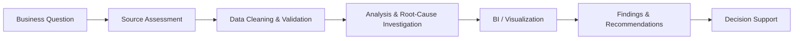

  
  
  

### I investigate what is driving the numbers — then turn the evidence into decisions.

`SQL` · `Power BI` · `Python` · `Excel` · `Data Quality` · `Reporting` · `Risk Analytics`

---

## Executive Portfolio Snapshot

<table>
<tr>
<td width="25%" align="center"><b>3,755</b> real-world salary records analyzed</td>
<td width="25%" align="center"><b>10</b> cross-system data issues documented</td>
<td width="25%" align="center"><b>~22.5K</b> mortgage records analyzed</td>
<td width="25%" align="center"><b>4</b> risk models evaluated</td>
</tr>
</table>

I am a BI/Data Analyst with an **M.S. in Information Systems from Virginia Commonwealth University, School of Business**. My work centers on messy, fragmented, or decision-critical data: validating it, reconciling inconsistencies, identifying the drivers behind outcomes, and communicating the result through dashboards, analysis, and structured recommendations.

Rather than treating projects as isolated technical exercises, I structure them as **business questions → analytical method → evidence → decision support**.

---

## Analytical Operating Model

---

# Selected Case Studies

## 01 — AI & Data Science Salary Intelligence
### Power BI + Python | Compensation & Workforce Analytics

**Decision question**  
How do compensation patterns differ by role, experience, company size, geography, year, and work arrangement?

**Analytical evidence**
- Analyzed **3,755 real-world salary observations** spanning AI, ML, and Data Science roles.
- Built a **3-page Power BI decision dashboard** covering executive overview, salary intelligence, and global/work-arrangement trends.
- Added a reproducible **Python validation workflow** for row counts, duplicates, missing values, category coverage, and grouped salary summaries.
- Applied sample-size awareness when comparing job-title compensation to avoid over-interpreting tiny groups.

**Portfolio signal**  
`Business Intelligence` `Power BI` `Python` `Data Validation` `Executive Reporting` `Data Storytelling`

**[Open full case study →](https://github.com/gudhatin28/ai-job-market-powerbi-dashboard)**

---

## 02 — Utility & Asset Data Integration | Henrico County
### Data Quality + Integration + Governance

**Decision problem**  
Fragmented utility and infrastructure asset data created reconciliation, data-quality, and cross-system integration challenges.

**Analytical evidence**
- Identified and documented **10 core data-quality and integration problems**, including duplicate records, missing asset IDs, inconsistent schemas and coordinates, outdated GIS layers, and siloed systems.
- Contributed to the **Unified Utility & Asset Data Integration Framework (UADIF)**.
- Mapped identified problems to standardized schemas, unique asset identifiers, geospatial normalization, ETL-based integration, authoritative layers, and governance controls.
- Developed recommendations and a phased implementation roadmap supporting a more reliable asset-data environment for infrastructure decision-making.

**Portfolio signal**  
`Data Quality` `Data Integration` `Data Governance` `Data Reconciliation` `Root-Cause Analysis` `GIS / Asset Data`

---

## 03 — Mortgage Delinquency Risk Analytics | Freddie Mac
### SQL + Python | Risk Segmentation & Scenario Analysis

**Decision question**  
How can higher-risk mortgage purchases be identified while preserving a high loan-purchase rate?

**Analytical evidence**
- Analyzed approximately **22,500 mortgage loan records**.
- Evaluated **4 machine-learning models**: Random Forest, Logistic Regression, Decision Tree, and SVM.
- Investigated risk patterns involving **credit score, LTV, and DTI**.
- Evaluated **0.5%, 1.0%, and 1.5% risk-threshold scenarios**.
- The project estimated that excluding the highest-risk **1.5% of loans** could represent approximately **$2.06B in potential savings** while supporting a **98% loan-purchase objective**.

**Portfolio signal**  
`SQL` `Python` `Risk Analytics` `Scenario Analysis` `Machine Learning` `Decision Support`

---

## 04 — Gym Management & Performance Tracking System
### Research Collaboration + SQL + Application Analytics

**Project scope**
- Collaborated with a **5-member research team over 6 months**.
- Contributed to **Workout History and Dashboard** components for tracking member activity.
- Used SQL, Excel, and Python to support analysis, reporting, and research deliverables.
- Maintained project documentation and version history across the project lifecycle.

**Portfolio signal**  
`SQL` `Python` `Excel` `JavaScript` `Git/GitHub` `Research Documentation`

**[Open repository →](https://github.com/gudhatin28/Gym-Management-and-Performance-Tracking-System)**

---

## Capability Matrix

| Business Need | How I Work | Tools / Methods |
|---|---|---|
| **Understand what changed** | Trend, variance, segmentation, KPI analysis | SQL, Excel, Power BI, Python |
| **Find why numbers do not match** | Reconciliation, validation, root-cause investigation | SQL, Python, data-quality checks |
| **Turn analysis into reporting** | Interactive dashboards, executive summaries, visual storytelling | Power BI, Excel |
| **Assess risk** | Threshold analysis, scenario comparison, model evaluation | Python, SQL, ML methods |
| **Improve fragmented data environments** | Schema alignment, data-governance recommendations, integration frameworks | Data mapping, ETL concepts, governance |
| **Communicate with stakeholders** | Findings, recommendations, documentation, presentations | Business communication, structured reporting |

---

## Technology Stack

 

---

## Professional Direction

I am targeting **BI Analyst and Data Analyst** roles where analytical work connects directly to business decisions — particularly environments involving reporting, data quality, operational analysis, risk, or cross-system data.

My strongest value is not simply producing charts. It is **tracing the evidence behind a result, checking whether the result is trustworthy, and translating it into something a stakeholder can act on.**

---

## Education

**Master of Science in Information Systems**  
Virginia Commonwealth University — School of Business

---

### Professional Links

  

Portfolio built around evidence, reproducibility, and decision-ready analytics.

